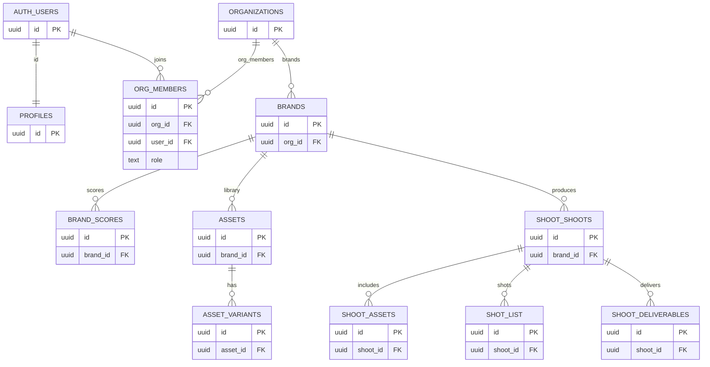
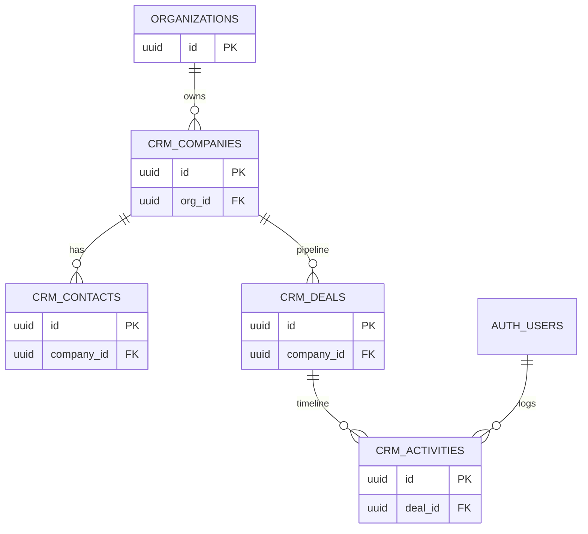
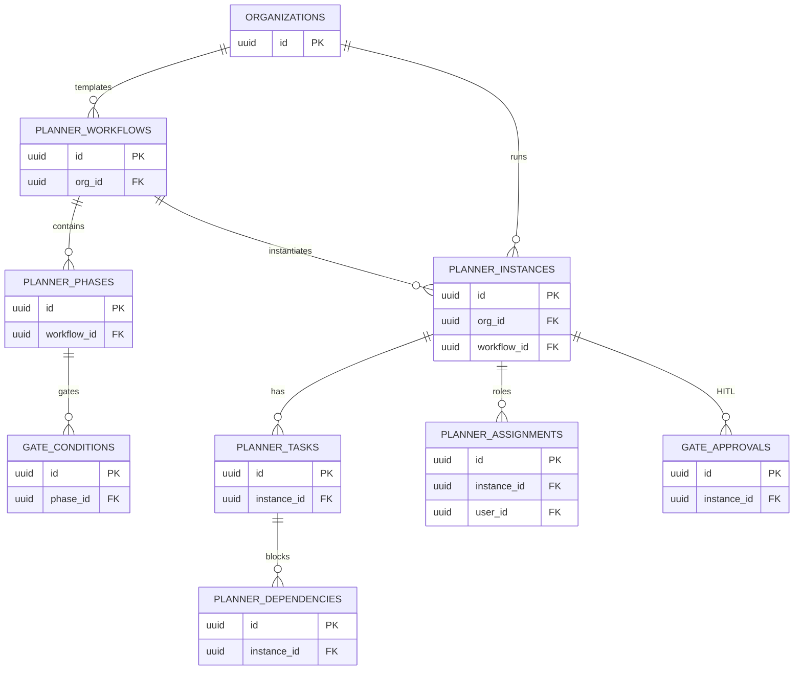
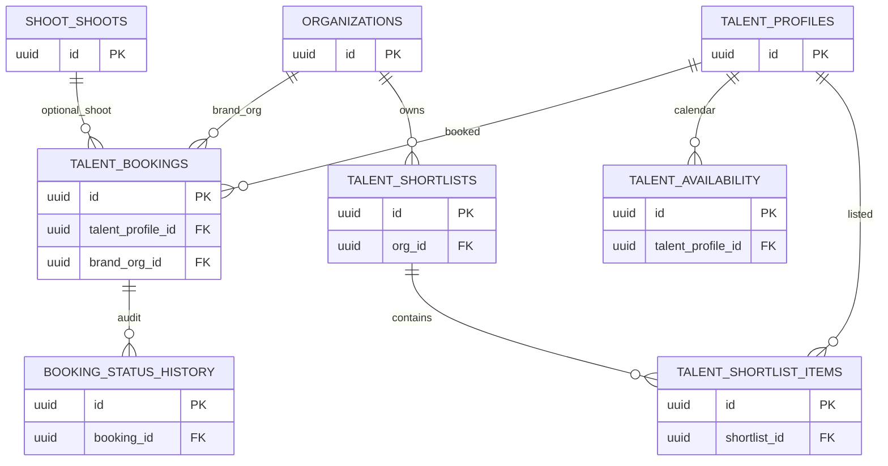
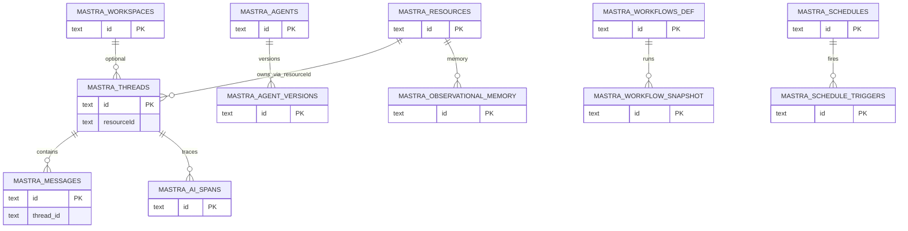

# Relationships and ERDs

Live FKs exist on org/brand/CRM/planner/shoot/talent. **`mastra.*` has no Postgres FKs** (Mastra store design). Isolation is `resourceId` in the app, not RLS JWT.

## Flags

| Issue | Evidence |
|-------|----------|
| Orphanable actor columns | Unindexed FKs: `planner.instances.owner_user_id`, `shoot.shoots.created_by`, `talent.bookings` requested/approved/cancelled_by |
| Duplicate shoot graphs | `public.shoot_*` vs `shoot.*` |
| Planner tasks | `phase_id`, `parent_task_id` FKs without covering indexes (advisor) |

---

## Core org / brand / shoot / assets

---

## CRM

---

## Planner

Cross-domain: instances carry `entity_type` / `entity_id` (brand/shoot) **without a hard FK** — app must validate org.

---

## Talent / booking

---

## Mastra (logical, not FK)

**New iPix `resourceId` (Core):** `org:{orgId}:user:{userId}` — not a DB FK.
