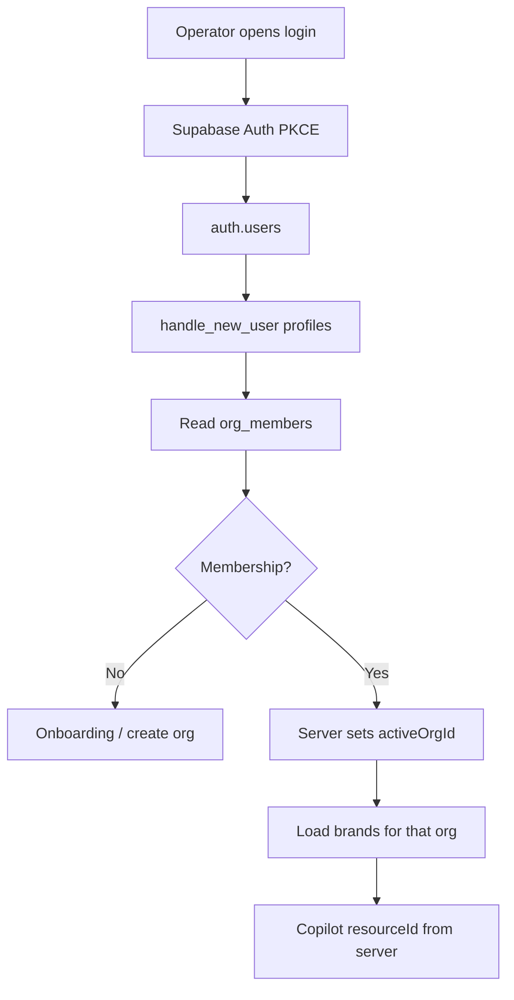
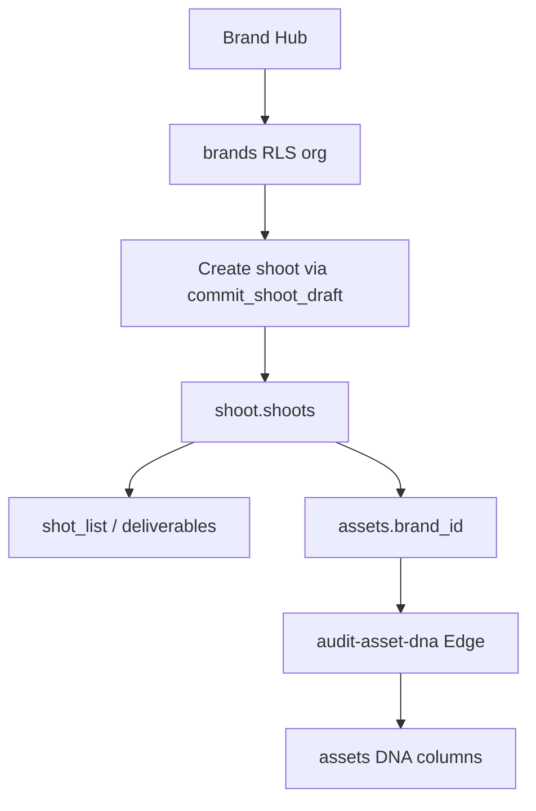
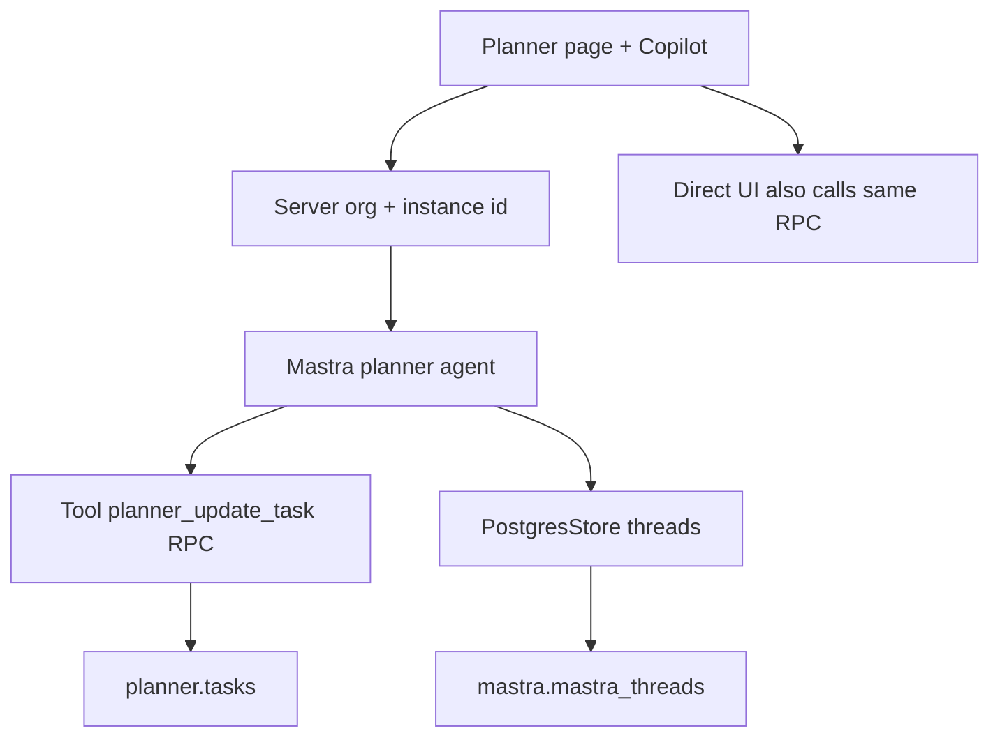
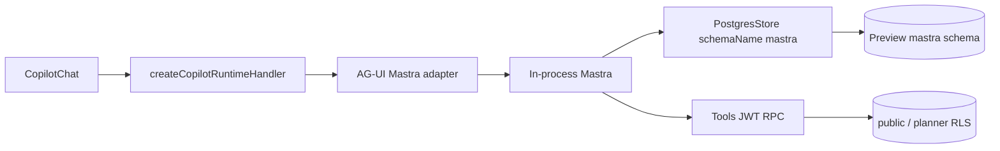
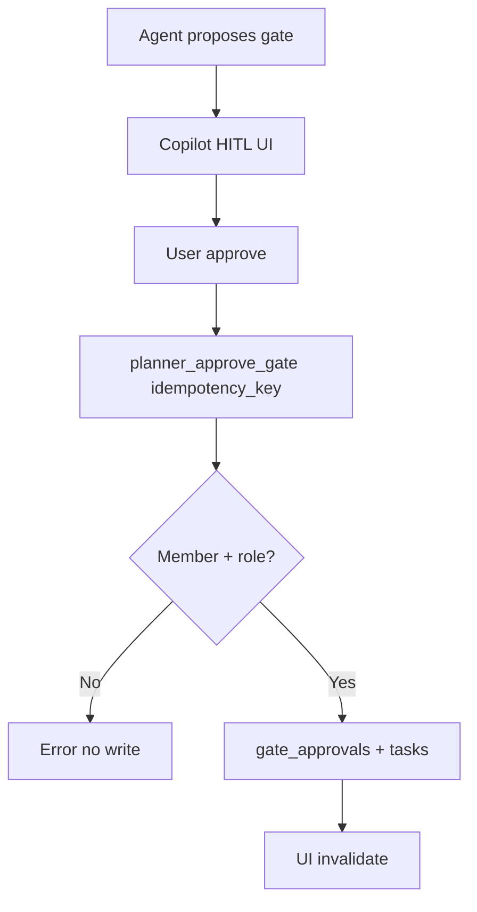
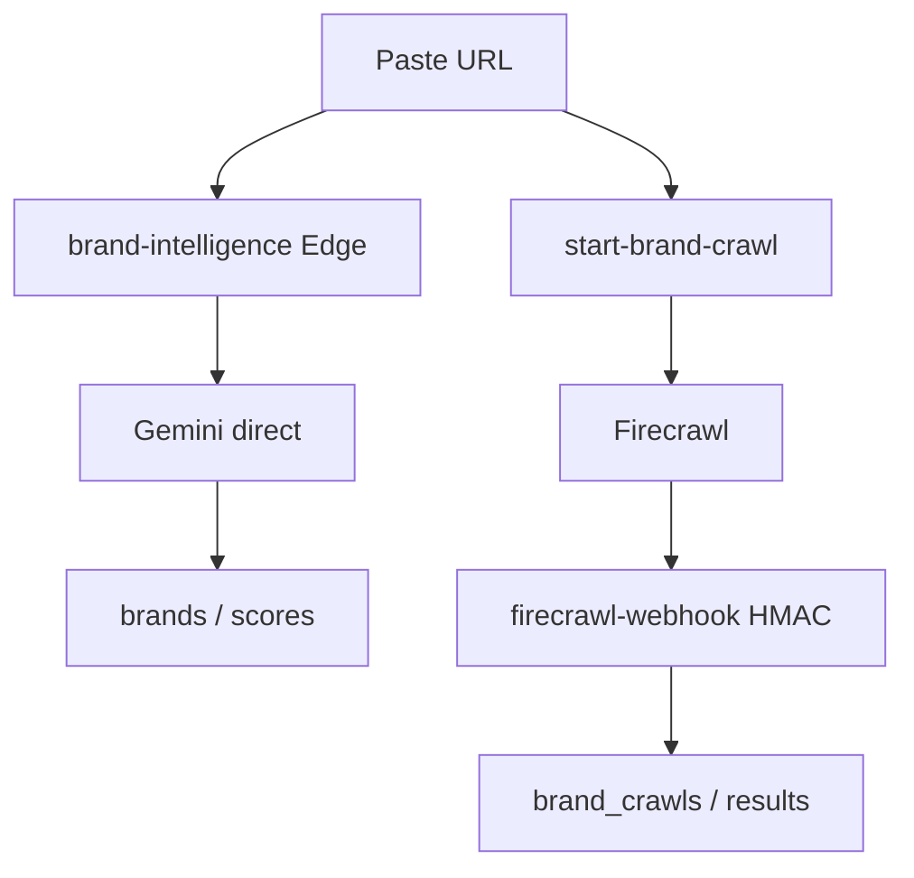
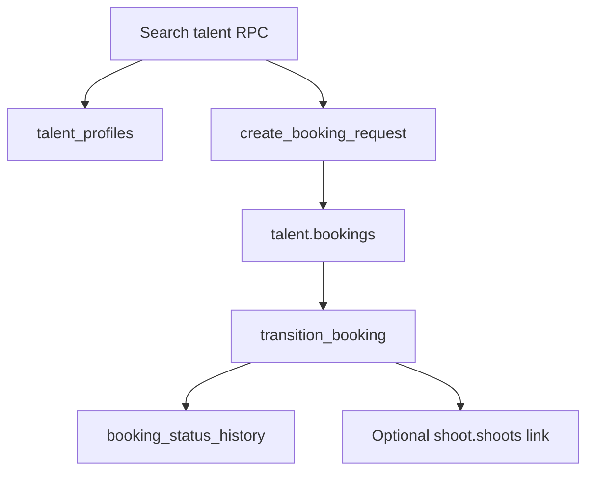

# Wiring and data flows

## Frontend → backend map

| UI | Path | Table / fn | Update |
|----|------|------------|--------|
| Login | Auth callback | `auth.users`, `profiles` | Session cookie |
| Brand Hub | RSC + `operator-client` + Edge `brand-intelligence` / crawl | `brands`, crawl tables | Refresh query |
| Assets | Client + `audit-asset-dna` | `assets` | DNA columns |
| CRM | Client CRUD + `crm_convert_deal` | `crm_*` | Board |
| Planner | Client + `planner_*` RPCs | `planner.*` | Realtime optional |
| Shoot | `commit_shoot_draft` / `get_shoot_detail` | `shoot.*` | Detail page |
| Booking | `create_booking_request` / `transition_booking` | `talent.bookings` | Status |
| Copilot | **Today:** fat route · **New:** starter handler → Mastra → `PostgresStore` | `mastra.*` | Thread persist |
| HITL | RPC `planner_approve_gate` | `gate_approvals`, tasks | Board |

**Unnecessary hop today:** Copilot route reimplements storage/auth. **Replace** with official handler; keep RPCs for domain writes.

Mastra tools that `UPDATE planner.tasks` via service role = **wrong hop**. Use RPC as the user.

---

## 1. Login + org

---

## 2. Brand → shoot → assets

---

## 3. Production Planner chat

---

## 4. CopilotKit → AG-UI → Mastra → PostgresStore

---

## 5. HITL → Supabase write

---

## 6. Brand Intelligence

---

## 7. Booking

